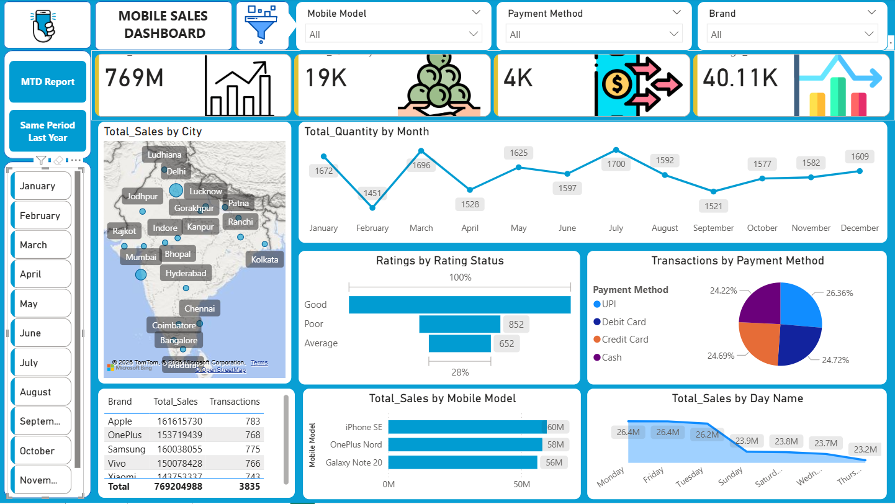

#  Business Insights Dashboard  
### Power BI Mobile Sales Data Analysis

---

##  Project Overview
This project presents an interactive Power BI dashboard developed to analyze and visualize mobile sales data.  
The dashboard transforms raw transactional data into actionable business insights through dynamic visuals, KPIs, and filters.

It enables stakeholders to monitor performance across cities, brands, payment methods, and time periods, supporting data-driven decision-making.

---

##  Business Objective
The primary objective of this project is to:

- Analyze overall mobile sales performance  
- Identify top-performing cities, brands, and models  
- Track monthly sales and quantity trends  
- Understand customer purchasing behavior  
- Evaluate payment method preferences  
- Analyze customer rating distribution  
- Identify weekly sales patterns  

---

##  Key Performance Indicators (KPIs)

- Total Sales Revenue  
- Total Quantity Sold  
- City-wise Sales Contribution  
- Month-wise Sales & Quantity Trends  
- Brand & Model Performance  
- Payment Method Distribution  
- Customer Rating Analysis  
- Day-wise Sales Performance  

---

##  Tools & Technologies Used

- Microsoft Power BI  
- Data Cleaning & Transformation  
- Data Modeling  
- DAX Measures  
- Interactive Visualizations  
- KPI Design  
- Slicers & Filters  

---

##  Dataset
The dataset contains mobile sales transaction records including:

- City  
- Brand & Model  
- Sales Revenue  
- Quantity Sold  
- Payment Method  
- Customer Rating  
- Date of Purchase  

---

##  Data Analysis Process

1. Imported and cleaned raw sales data  
2. Handled missing values and removed inconsistencies  
3. Structured tables for optimized data modeling  
4. Created calculated measures using DAX (Total Sales, Quantity, Transactions)  
5. Built interactive visuals (Map, Bar Chart, Line Chart, Pie Chart, KPI Cards)  
6. Applied slicers for dynamic filtering (Month, Brand, Payment Method, Model)  
7. Designed a clean and user-friendly dashboard layout  

---

##  Key Insights

- Total sales reached approximately **769M**, indicating strong market demand  
- Major metropolitan cities contributed the highest revenue share  
- Monthly sales show seasonal fluctuations with peak-performing months  
- Certain brands and models dominate total revenue contribution  
- Digital payment methods (UPI & Cards) are preferred over cash  
- Most customer ratings fall under the “Good” category  
- Sales vary across weekdays, revealing customer buying patterns  

---

## 📷 Dashboard Preview

---

##  Business Impact

This dashboard helps businesses:

- Monitor real-time sales performance  
- Identify high-revenue cities and brands  
- Optimize inventory planning  
- Improve marketing strategies  
- Enhance customer targeting  
- Support strategic decision-making  

---

##  Future Enhancements

- Implement predictive sales forecasting  
- Add customer segmentation analysis  
- Connect live database sources  
- Build automated refresh pipeline  

---

##  Skills Demonstrated

- Business Data Analysis  
- Power BI Dashboard Development  
- DAX Calculations  
- Data Modeling  
- KPI Design  
- Analytical Thinking  
- Data Storytelling  

---

##  Conclusion

This project demonstrates the ability to convert raw sales data into a structured and interactive business intelligence solution using Power BI. It highlights strong analytical capabilities and practical understanding of performance monitoring and decision support systems.

## Dataset used
https://github.com/Anuj-codes21/Business-Insights-Dashboard/blob/main/MS_Dashboard%20-.pbix
